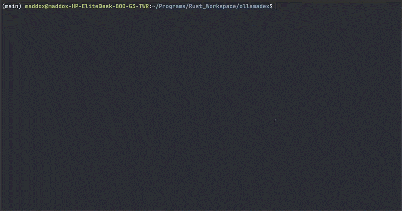
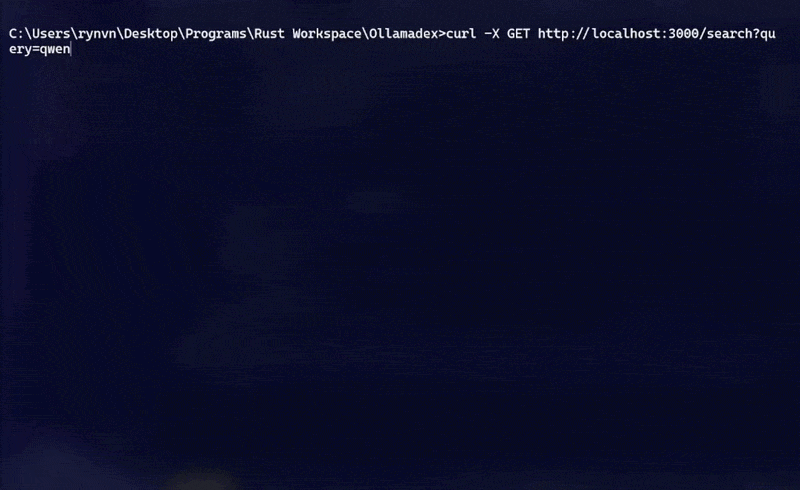

[](LICENSE)


<div align="center">
  <div style="
    border: 1px solid rgba(128, 128, 128, 0.3); 
    border-radius: 8px; 
    padding: 15px; 
    display: inline-block;
    max-width: 100%;
    box-sizing: border-box;
    margin-bottom: 15px;
  ">
    <pre style="
      margin: 0; 
      background: transparent; 
      font-family: monospace;
      line-height: 1.1;
      overflow-x: auto;
    ">
 ██████╗ ██╗     ██╗      █████╗ ███╗   ███╗ █████╗ ██████╗ ███████╗██╗  ██╗
██╔═══██╗██║     ██║     ██╔══██╗████╗ ████║██╔══██╗██╔══██╗██╔════╝╚██╗██╔╝
██║   ██║██║     ██║     ███████║██╔████╔██║███████║██║  ██║█████╗   ╚███╔╝ 
██║   ██║██║     ██║     ██╔══██║██║╚██╔╝██║██╔══██║██║  ██║██╔══╝   ██╔██╗ 
╚██████╔╝███████╗███████╗██║  ██║██║ ╚═╝ ██║██║  ██║██████╔╝███████╗██╔╝ ██╗
 ╚═════╝ ╚══════╝╚══════╝╚═╝  ╚═╝╚═╝     ╚═╝╚═╝  ╚═╝╚═════╝ ╚══════╝╚═╝  ╚═╝</pre>
  </div>
</div>

---

Welcome to **Ollamadex**, a clean, localized index and management engine designed to tame the expanding ecosystem of local AI. Instead of jumping back and forth to a browser to find the right tool for the job, Ollamadex acts as a private directory that automatically organizes available models, their parameter sizes, capabilities, and specific variants into a single, lightning-fast database on your machine. Built to be entirely self-contained and private, it gives you a deeply queryable inventory of the local AI landscape, making it perfect for powering custom application pickers, automating model workflows, or simply keeping track of the best weights available for your hardware.

<div align="center">
  <table width="96%">
    <tr>
      <td width="50%" align="center">
        <p><b>Server View</b></p>
        
      </td>
      <td width="50%" align="center">
        <p><b>Client View</b></p>
        
      </td>
    </tr>
  </table>
</div>

---

## Features

> * **Local-first model index** - scrapes and stores Ollama's model library (names, descriptions, capability tags, size tags, cloud availability, and per-variant details like context length and disk size) into a single SQLite database on your machine.
> * **Fuzzy search caching** - incoming search queries are compared against previously cached queries using Jaro-Winkler string similarity. A close-enough match (≥0.85 similarity) reuses the cached results instead of re-scraping, cutting down on redundant network calls.
> * **On-demand scraping fallback** - if a query has no cached match (or a specific model isn't found by `href`), Ollamadex scrapes ollama.com live, persists the results, and serves them from the database from then on.
> * **Configurable cache staleness** - how long a cached query is considered valid (default: 600 seconds / 10 minutes) is stored in `app_settings` and adjustable at runtime via an authenticated endpoint.
> * **Environment-based API key auth** - the server requires a pre-configured ADMIN_API_KEY to be set in your root `.env` file on startup for admin actions (e.g., updating cache settings).
> * **Simple REST API** - built on [Axum](https://github.com/tokio-rs/axum), exposing endpoints to search, look up a specific model, list everything indexed, and tune caching behavior.
> * **Containerized** - ships with a `Dockerfile` and `docker-compose.yaml` for one-command setup, no local Rust toolchain required.

## Prerequisites

Before setting up Ollamadex, make sure you have the following installed:

* [Rust & Cargo](https://www.rust-lang.org/tools/install)
* [Docker](https://docs.docker.com/get-started/get-docker/)
* [Docker Compose](https://docs.docker.com/compose/install/)

## Installation & Setup

### 1). Clone the repository:

> ```bash
> git clone https://github.com/Maddox-RVS/Ollamadex
> cd Ollamadex
> ```

### 2). Configure Environment

> **1).** Create a `.env` file in the root of your project directory.   
>
> ---
> **2).** Set your administrative API key. This key is required for all protected endpoints like updating cache settings or thresholds:
>
> **`.env`**  
> ```bash
> ADMIN_API_KEY=your_secure_api_key_here
> ```
> ---
> **3).** Set the server mode to either `private` or `public`. Private means that the server will only respond to requests from the host machine, while public responds to requests from anything.  
>
> **`.env`**
> ```bash
> SERVER_MODE=private
> ```
> or  
>
> **`.env`**
> ```bash
> SERVER_MODE=public
> ```
> ---
> **4).** Set the port number (0-65535) the server should listen on.
>
> **`.env`**
> ```bash
> PORT=3000
> ```
> ---
> **The full server `.env` should look as follows:**
>
> **`.env`**
> ```bash
> ADMIN_API_KEY=your_secure_api_key_here
> SERVER_MODE=private
> PORT=3000
> ```
>
> | **`.env`** Variables | Required |
> | -------------------- | -------- |
> | `ADMIN_API_KEY`      | Yes      |
> | `SERVER_MODE`        | Yes      |
> | `PORT`               | Yes      |

### 3). Run it:

> **Option A - with Docker Compose (recommended):**
> ```bash
> docker compose up --build
> ```

> **Option B - with Cargo:**
> ```bash
> cargo run --release
> ```

**Note:** *If the `.env` file is missing or required environment variables cannot be read, the server will panic on startup and print an error requesting the environment variables be set properly in the `.env` file.*

## API Reference

### `GET /search`

> Searches the local cache for models matching a query, scraping and indexing fresh results from ollama.com if no sufficiently similar cached search exists yet.

| Query Param | Type     | Required | Description                      |
| ----------- | -------- | -------- | -------------------------------- |
| `query`     | `string` | Yes      | The search term to look up       |

**Example:**
```bash
curl "http://localhost:3000/search?query=llama3"
```

### `POST /find`

> Looks up a specific model by its ollama.com page path, scraping and indexing it if it isn't already in the local database.

**Body:**
| Field        | Type     | Required | Description                                              |
| ------------ | -------- | -------- | ---------------------------------------------------------- |
| `href`       | `string` | Yes      | The model's page path (e.g. `"/library/llama3.3"`)        |
| `model_name` | `string` | Yes      | The model name to scrape with |

**Example:**
```json
{
  "href": "/library/llama3.3",
  "model_name": "llama3.3"
}
```

### `GET /all`

> Returns every model currently indexed in the local database.

No parameters required.

### `POST /cache_stale_seconds`

> Updates how long (in seconds) a cached search is considered fresh before a new scrape is triggered. Requires a valid `api_key`.

**Body:**
| Field                  | Type    | Required | Description                                  |
| ---------------------- | ------- | -------- | --------------------------------------------- |
| `cache_stale_seconds`  | `i64`   | Yes      | New staleness threshold, in seconds           |
| `api_key`              | `string`| Yes      | Server-issued API key (printed on startup)    |

### `GET /cache_similarity_threshold`

> Returns the current similarity threshold (0.0–1.0) used to decide whether an incoming query is "close enough" to a previously cached search to reuse its results instead of re-scraping.

No parameters required.

**Example response:**
```json
{ "cache_similarity_threshold": 0.85 }
```

### `POST /cache_similarity_threshold`

> Updates the similarity threshold used for cache matching. Requires a valid `api_key`.

**Body:**
| Field                          | Type     | Required | Description                                          |
| ------------------------------ | -------- | -------- | ----------------------------------------------------- |
| `cache_similarity_threshold`   | `f64`    | Yes      | New threshold, must be between `0.0` and `1.0`        |
| `api_key`                      | `string` | Yes      | Server-issued API key (printed on startup)            |

**Example:**
```json
{
  "cache_similarity_threshold": 0.9,
  "api_key": "your_api_key"
}
```

## Database Schema

Ollamadex uses a structured SQLite relational database consisting of four main tables to handle application configuration, query caching, indexed models, and their respective architectural variants.

### 1. `app_settings`
> Stores persistent global key-value configuration flags.
> 
> | Column | Type | Constraints | Description |
> | :--- | :--- | :--- | :--- |
> | `key` | `TEXT` | `PRIMARY KEY` | Setting name identifier |
> | `value` | `TEXT` | `NOT NULL` | Associated configuration value (e.g., `'600'` for `cache_stale_seconds`) |

### 2. `search_cache`
> Caches scrapers' queries with timestamps to prevent unnecessary external hits.
> 
> | Column | Type | Constraints | Description |
> | :--- | :--- | :--- | :--- |
> | `id` | `INTEGER` | `PRIMARY KEY AUTOINCREMENT` | Unique cache record ID |
> | `query` | `TEXT` | `NOT NULL UNIQUE` | Scraped query string |
> | `searched_at` | `TEXT` | `NOT NULL` | ISO 8601 formatted timestamp |

### 3. `models`
> Contains metadata indexing the main, parent LLM families.
> 
> | Column | Type | Constraints | Description |
> | :--- | :--- | :--- | :--- |
> | `id` | `INTEGER` | `PRIMARY KEY AUTOINCREMENT` | Unique parent model ID |
> | `name` | `TEXT` | `NOT NULL` | General model name (e.g., `"llama3"`) |
> | `description` | `TEXT` | `NOT NULL` | Description scraped from ollama's website |
> | `capability_tags` | `TEXT` | `NOT NULL` | Capabilities serialized as a JSON array |
> | `size_tags` | `TEXT` | `NOT NULL` | Parameter size tags serialized as a JSON array |
> | `cloud_tag` | `BOOLEAN` | `NOT NULL` | Boolean flag indicating cloud availability |
> | `url` | `TEXT` | `NOT NULL UNIQUE` | Direct URL link to the model page on ollama's website |

### 4. `model_variants`
> Tracks individual weights, parameter configurations, and context sizes linked to parent models.
> 
> | Column | Type | Constraints | Description |
> | :--- | :--- | :--- | :--- |
> | `id` | `INTEGER` | `PRIMARY KEY AUTOINCREMENT` | Unique variant ID |
> | `model_id` | `INTEGER` | `NOT NULL`, `FOREIGN KEY` | References `models(id)` `ON DELETE CASCADE` |
> | `model_identifier` | `TEXT` | `NOT NULL` | Full reference string (e.g., `"llama3:8b-instruct-q8_0"`) |
> | `size` | `TEXT` | `NOT NULL` | File footprint size on disk |
> | `context` | `TEXT` | `NOT NULL` | Supported sequence context length limit |
> | `input` | `TEXT` | `NOT NULL` | Accepted input formats / modalities |
> | `url` | `TEXT` | `NOT NULL` | Direct tag manifest page reference URL |